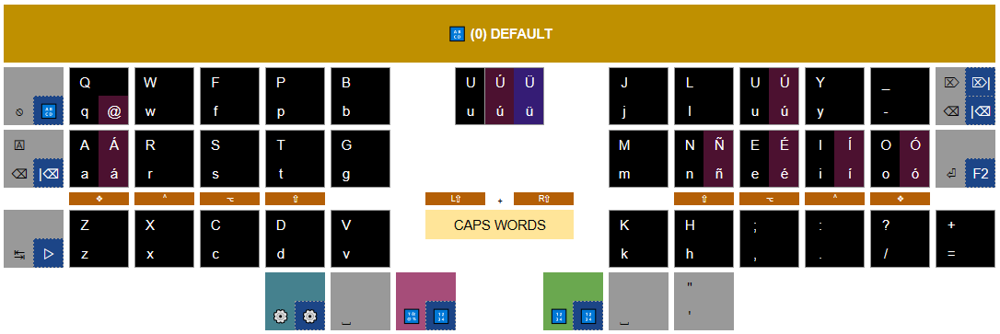
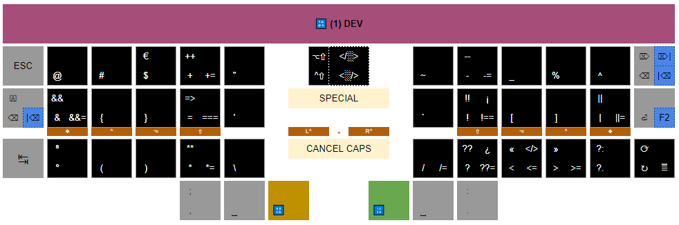
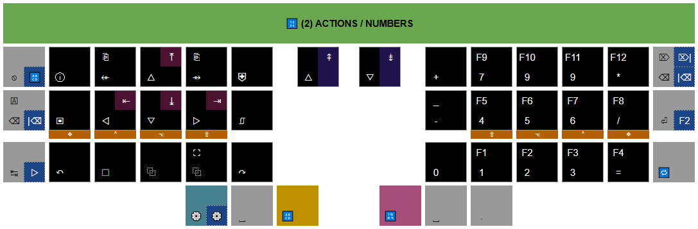

# ZMK Configuration

ZMK configuration for [swept-crkbd](https://github.com/AYM1607/swept-crkbd/) also compatible with [crkbd](https://github.com/foostan/crkbd) wireless version with [nice!nano](https://nicekeyboards.com/nice-nano/).

This is a WIP layout based on Colemak DHm for using on Windows, taking in mind some Spanish accents, easy access to development symbols and JS/TS shortcuts.

---

## Menu

- [Usage](#usage)
  - [Turn on/off](#turn-onoff)
  - [Charge](#charge)
  - [Reset](#reset)
  - [Configure](#configure)
- [Keyboard](#keyboard)
  - [Conventions](#conventions)
  - [Layouts](#layouts)
    - [0. Base](#0-base-)
    - [1. Dev](#1-dev-)
    - [2. Actions/Numbers](#2-actionsnumbers-)
    - [3. Settings](#3-settings-)
- [About](#about)

---

## Usage

### Turn on/off

There's a small slider switch right underneath the USB-C connector which controls power. The keyboard is **OFF** when the sliders on both halves are on the left positions as shown in the following picture:

TODO: add picture

The keyboard is **ON** when the switch is slided to the right on both halves as shown in the following picture. Please note that for the halves to connect correctly, the both must be turned on as closely to THE SAME TIME as possible; it's okay if there's one or two seconds of difference but try to keep it to a minimum.

TODO: add picture

### Charge

To charge your boards you must put the half you want to charge in the ON position and connect it to a power source (it can be your computer) through the USB port.

You know it's charging if you see an orange light like the one in the following picture. The light turns off when charging is done.

TODO: add picture

### Reset

TODO: add picture

### Configure

The wireless version of the Swept use ZMK as their firmware, you can find out more at [ZMK docs](https://zmk.dev/docs)

These pages will guide you to create your own keymap (follow them after your user-setup) [customization](https://zmk.dev/docs/customization) and [keymaps](https://zmk.dev/docs/features/keymaps)

Once you make changes to your keymap, you can download the firmware from the github actions tab of your repo. Since the keyboards come pre-flashed by me, you only need to flash the left half to change your keymaps. You can do it by following these steps:

1. Turn off both halves.

2. Plug in the left half into your computer (without turning it on)

3. "Double tap" the reset button, play around with the timing between taps since this might not work the first time. If you have trouble with this step, re-plug your board and try again, you might even need to use a different cable or port on your computer. You know this works if you see a blue light fading on and off coming from the nice nano.

4. After the previous step you should see a new storage device in your computer called nice!nano, as shown in the picture below. Drag and drop (or copy and paste) the firmware file `corne_left-nice_nano_v2-zmk.uf2`  which you should have generated and downloaded by following the guides linked above.

5. Wait until the storage device automatically disappears from your computer, this should not take longer than a few seconds.

6. Unplug the board from your computer
Follow the procedure in "How to turn my keyboard on?"

⇧ [Back to menu](#menu)

---

## Keyboard

### Conventions

Icons used to describe some modifiers and actions

| Key | Description |
| :-: | ----------- |
| ◆ | Win/GUI |
| ⌃ | Control |
| ⌥ | Alt |
| ⇧ | Shift |
| 🄰 | Caps Lock|
| ⎋ | Esc |
| ↹ | Tab |
| ⌫ | Backspace |
| ⌦ | Del |
| ⏎ | Return |
| ⇪ | [Hold Tap](https://zmk.dev/docs/behaviors/hold-tap#hold-tap) |
| 🔁 | [Key Repeat](https://zmk.dev/docs/behaviors/key-repeat) |

Key modifiers Description

### Layouts

#### 0. Base 🔠

Letters, accents for Spanish language and quick shortcuts for most used symbols to "avoid" changing layers.

**Modifiers**

| Combinations                             | Actions               |
| ---------------------------------------: | --------------------- |
| <kbd>⇪⌫</kbd>                           | delete word backward   |
| <kbd>⇪⌦</kbd>                           | delete word forward    |
| <kbd>⇪⏎</kbd>                           | rename (like macOS)    |

**Spanish**

| Combinations                                        | Key |
| --------------------------------------------------: | :-: |
| <kbd>⌥</kbd>+<kbd>a</kbd>                           | á   |
| <kbd>⇧</kbd>+<kbd>⌥</kbd>+<kbd>a</kbd>              | Á   |
| <kbd>⌥</kbd>+<kbd>e</kbd>                           | é   |
| <kbd>⇧</kbd>+<kbd>⌥</kbd>+<kbd>e</kbd>              | É   |
| <kbd>⌥</kbd>+<kbd>i</kbd>                           | í   |
| <kbd>⇧</kbd>+<kbd>⌥</kbd>+<kbd>i</kbd>              | Í   |
| <kbd>⌥</kbd>+<kbd>o</kbd>                           | ó   |
| <kbd>⇧</kbd>+<kbd>⌥</kbd>+<kbd>o</kbd>              | Ó   |
| <kbd>⌥</kbd>+<kbd>u</kbd>                           | ú   |
| <kbd>⇧</kbd>+<kbd>⌥</kbd>+<kbd>u</kbd>              | Ú   |
| <kbd>⌥</kbd>+<kbd>⇪u</kbd>                          | ü   |
| <kbd>⇧</kbd>+<kbd>⌥</kbd>+<kbd>⇪u</kbd>             | Ü   |
| <kbd>⌥</kbd>+<kbd>n</kbd>                           | ñ   |
| <kbd>⇧</kbd>+<kbd>⌥</kbd>+<kbd>n</kbd>              | Ñ   |

**Symbols**

| Combinations                                        | Key |
| --------------------------------------------------: | :-: |
| <kbd>⌥</kbd>+<kbd>q</kbd>                          | @   |
| <kbd>⇧</kbd>+<kbd>,</kbd>                           | ;   |
| <kbd>⇧</kbd>+<kbd>.</kbd>                           | :   |
| <kbd>⇧</kbd>+<kbd>-</kbd>                           | +   |
| <kbd>⌥</kbd>+<kbd>-</kbd>                           | =   |
| <kbd>⇧</kbd>+<kbd>⌥</kbd>+<kbd>-</kbd>              | *   |
| <kbd>⇧</kbd>+<kbd>/</kbd>                           | &   |
| <kbd>⌥</kbd>+<kbd>/</kbd>                           | ?   |
| <kbd>⇧</kbd>+<kbd>⌥</kbd>+<kbd>/</kbd>              | \|   |
| <kbd>⇧</kbd>+<kbd>'</kbd>                           | "   |
| <kbd>⌥</kbd>+<kbd>'</kbd>                           | `   |
| <kbd>⇧</kbd>+<kbd>⌥</kbd>+<kbd>'</kbd>              | ~   |

**Brackets**

| Combinations                                        | Key |
| --------------------------------------------------: | :-: |
| <kbd>{}</kbd>                                       | {░}   |
| <kbd>⇧</kbd>+<kbd>{}</kbd>                           | (░)   |
| <kbd>⌥</kbd>+<kbd>{}</kbd>                           | [░]   |
| <kbd>⇧</kbd>+<kbd>⌥</kbd>+<kbd>{}</kbd>              | </░>   |
| <kbd>⇧</kbd>+<kbd>^</kbd>+<kbd>{}</kbd>              | <░/>   |

#### 1. Dev 🔣

Symbols and dev shortcuts for JS/TS.

#### 2. Actions/Numbers 🔢

Quick navigation actions and numbers.

#### 3. Settings ⚙️

Dedicated to Bluetooth and media controls.

⇧ [Back to menu](#menu)

---

## About

### Built With

- [VS Code](https://code.visualstudio.com/) - Code editing redefined.
- [corne-zmk-config](https://github.com/AYM1607/corne-zmk-config) - Colemak DHm layout
- [ZMK Docs](https://zmk.dev/docs) - Modern, open source keyboard firmware
- [Keymap Editor](https://nickcoutsos.github.io/keymap-editor) - GUI ZMK Keymap Editor
- [Colemak Mods](https://colemakmods.github.io/mod-dh/keyboards.html#matrix-keyboards) - Colemak-DH for a non-traditional, ergonomic keyboard

### Versioning

We use [SemVer](http://semver.org/) for versioning. For the versions available, see the [swept-zmk-config](https://github.com/deinsoftware/swept-zmk-config/tags) on GitHub.

### Authors

- **Camilo Martinez** [[Equiman](http://github.com/equiman)]

See also the list of [contributors](https://github.com/deinsoftware/swept-zmk-config/contributors) who participated in this project.

### Sponsors

If this project helps you, consider buying me a cup of coffee.

### License

This project is licensed under the MIT License - see the [LICENSE](LICENSE.md) file for details.

⇧ [Back to menu](#menu)
