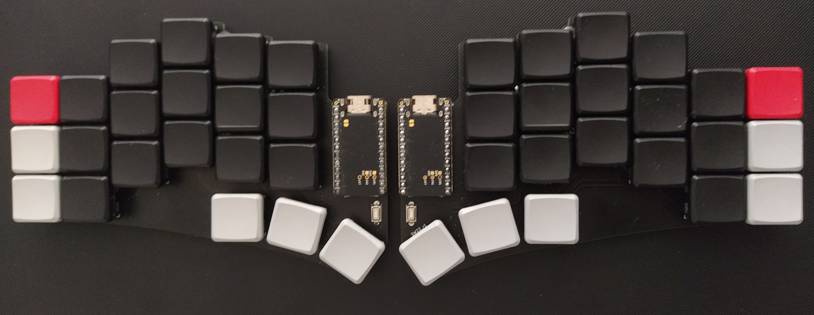
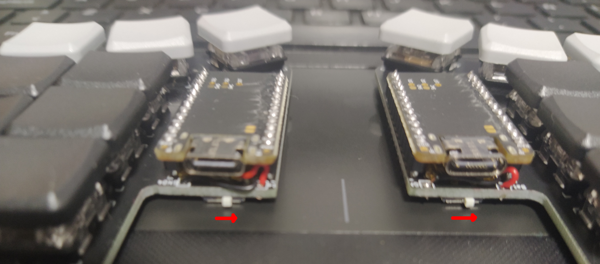
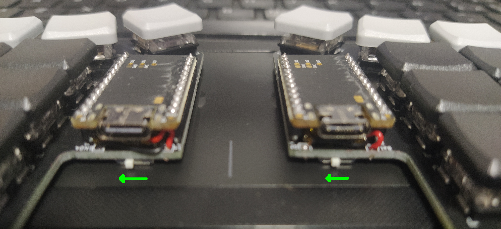
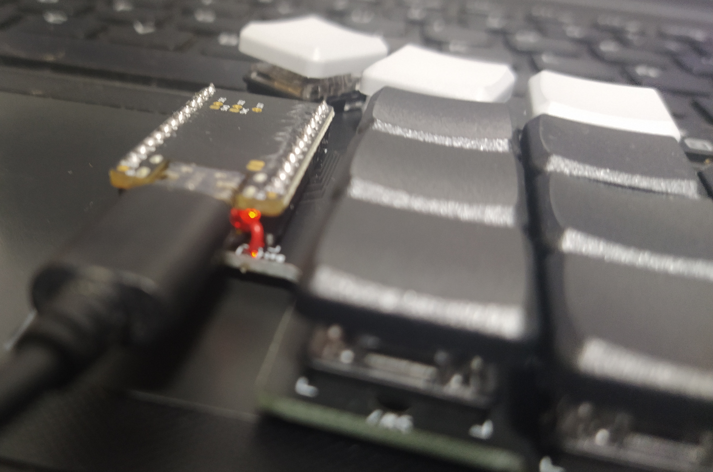
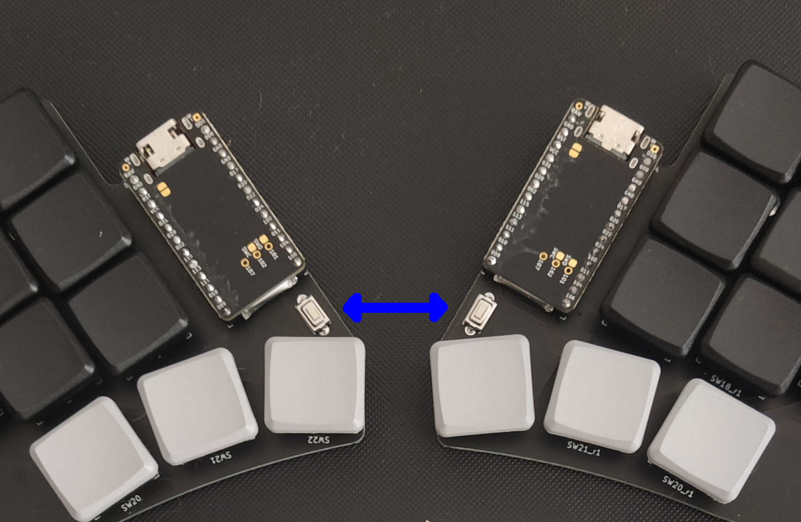

# ZMK Configuration

ZMK configuration for [swept-crkbd](https://github.com/AYM1607/swept-crkbd/) also compatible with [crkbd](https://github.com/foostan/crkbd) wireless version with [nice!nano](https://nicekeyboards.com/nice-nano/).

This is a WIP layout based on Colemak DHm that includes Spanish accents, and complemented with easy access to development symbols and JS/TS shortcuts.

---

## Menu

- Keyboard
  - [Windows](docs/windows.md)
  - [Android](docs/android.md)
- [Usage](#usage)
  - [Turn on/off](#turn-onoff)
  - [Charge](#charge)
  - [Reset](#reset)
  - [Configure](#configure)
  - [Led Indicators](#led-indicators)
  - [Battery Indicators](#battery-indicators)
- [Recommendations](#recommendations)
- [About](#about)

---

## Usage

### Turn on/off

There's a small slider switch right underneath the USB-C connector which controls power. The keyboard is **OFF** when the sliders on both halves are on the **left** positions as shown in the following picture:

The keyboard is **ON** when the switch is slided to the **right** on both halves as shown in the following picture (a few blue led flashing fast indicate two halves are paring each other).

Please note that for the halves to connect correctly, the both must be turned on as closely to THE SAME TIME as possible; it's okay if there's one or two seconds of difference but try to keep it to a minimum.

### Charge

To charge your boards you must put the half you want to charge in the ON position and connect it to a power source (it can be your computer) through the USB port.

You know it's charging if you see an orange led like the one in the following picture. The light turns off when charging is done.

### Reset

Pressing it once resets the keyboard (power cycle so essentially equivalent to turning it off and then back on).

Pressing it twice quickly puts into programming mode, if you plug it into your computer it shows up as a USB device instead of a keyboard; you can then drag and drop or copy and paste your firmware file to update your keymap.

### Configure

The wireless version of the Corne use ZMK as their firmware, you can find out more at [ZMK docs](https://zmk.dev/docs)

These pages will guide you to create your own keymap (follow them after your user-setup) [customization](https://zmk.dev/docs/customization) and [keymaps](https://zmk.dev/docs/features/keymaps)

Once you make changes to your keymap, you can download the firmware from the github actions tab of your repo. Since the keyboards come pre-flashed, you only need to flash the left half to change your keymaps. You can do it by following these steps:

1. Turn off both halves

2. Plug in the left half into your computer (without turning it on)

3. "Double tap" the reset button (blue led pulsing slowly), play around with the timing between taps since this might not work the first time. If you have trouble with this step, re-plug your board and try again, you might even need to use a different cable or port on your computer. You know this works if you see a blue light fading on and off coming from the nice nano.

4. After the previous step you should see a new storage device in your computer called nice!nano, as shown in the picture below. Drag and drop (or copy and paste) the firmware file `corne_left-nice_nano_v2-zmk.uf2` which you should have generated and downloaded by following the guides linked above.

5. Wait until the storage device automatically disappears from your computer, this should not take longer than a few seconds.

6. Unplug the board from your computer

7. Follow the procedure in [How to turn my keyboard on?](#turn-onoff)

### Led Indicators

| Color  | Mode           | Action                                                  |
| ------ | -------------- | ------------------------------------------------------- |
| Blue   | Pulsing slowly | bootloader mode (enter by double pressing reset button) |
| Blue   | Flashing fast  | halves are paring each other                            |
| Orange |                | Charging                                                |

---

## Recommendations

### VSCode Extensions

- [Const & Props Snippets](https://marketplace.visualstudio.com/items?itemName=deinsoftware.const-props-snippets)
- [Arrow Function Snippets](https://marketplace.visualstudio.com/items?itemName=deinsoftware.arrow-function-snippets)
- [Arrow Function Snippets](https://marketplace.visualstudio.com/items?itemName=deinsoftware.debug-snippets)

### Package Managers

- [Switch Package Manager](https://www.npmjs.com/package/swpm)

⇧ [Back to menu](#menu)

---

## About

### Fork

- [corne-zmk-config](https://github.com/AYM1607/corne-zmk-config) - ZMK Colemak DHm layout

### Built With

- [VS Code](https://code.visualstudio.com/) - Code editing redefined.
- [ZMK Docs](https://zmk.dev/docs) - Modern, open source keyboard firmware
  - [ZMK Split Battery](https://github.com/Fukkei/zmk-split-battery)
  - [ZMK PR Battery BLE](https://github.com/zmkfirmware/zmk/pull/1243)
- [Keymap Editor](https://nickcoutsos.github.io/keymap-editor) - GUI ZMK Keymap Editor
- [Colemak Mods](https://colemakmods.github.io/mod-dh/keyboards.html#matrix-keyboards) - Colemak-DH for a non-traditional, ergonomic keyboard
- [AutoHotKey](https://www.autohotkey.com/) v2 - The ultimate automation scripting language for Windows
- [Figma](https://www.figma.com/) - The collaborative interface design tool

### Typing

- [Colemak Club](https://gnusenpai.net/colemakclub/) - Learn Colemak Layout
- [Monkeytype](https://monkeytype.com/) - A minimalistic typing test, featuring many test modes, an account system to save your typing speed history and user configurable features like themes, a smooth caret and more.

### Versioning

We use [SemVer](http://semver.org/) for versioning. For the versions available, see the [swept-zmk-config](https://github.com/deinsoftware/swept-zmk-config/tags) on GitHub.

### Authors

- **Camilo Martinez** [[Equiman](http://github.com/equiman)]

See also the list of [contributors](https://github.com/deinsoftware/swept-zmk-config/contributors) who participated in this project.

### Sponsors

If this project helps you, consider buying me a cup of coffee.

### License

This project is licensed under the MIT License - see the [LICENSE](LICENSE.md) file for details.

⇧ [Back to menu](#menu)
